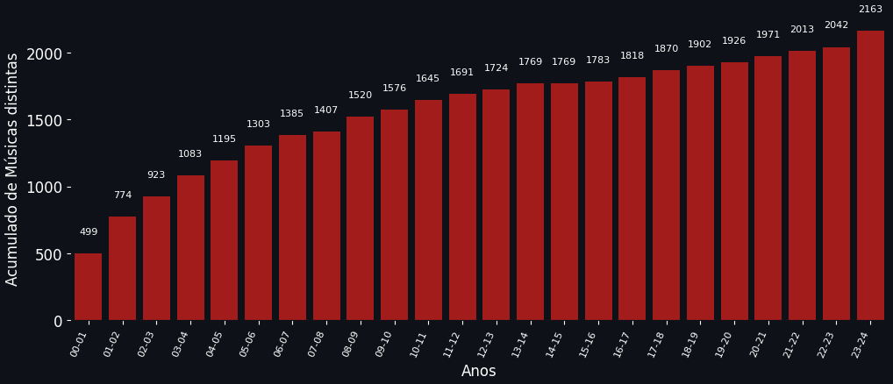
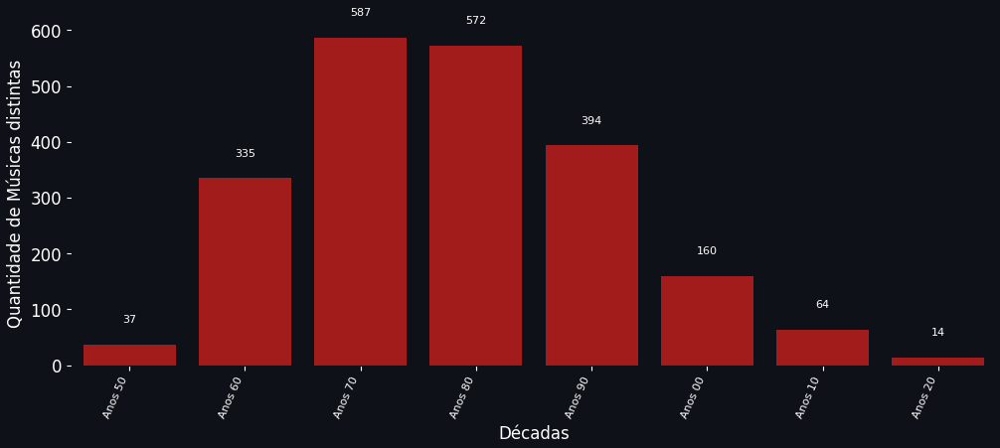
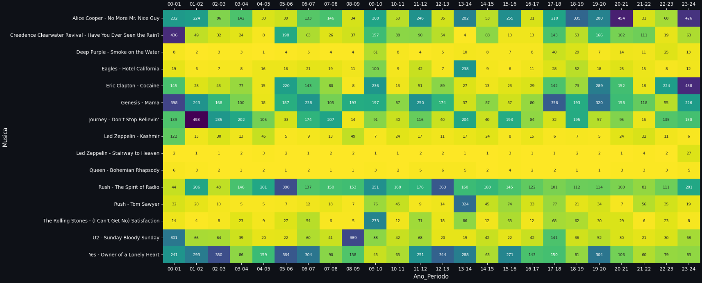

# 500mais-kissfm
Projeto de DataScience da lista das 500 mais da Kiss FM.

# Tratamento de dados

Antes da análise dos dados relativos à todos os anos das 500+ da Kiss FM foi necessário agrega-los. Os itens a seguir descrevem todo esse processo. 
A maior parte dele foi automatizada, porém em alguns momentos uma intervenção manual foi necessária. Dessa forma, eventuais erros podem ter sido introduzidos na listagem, já que a conferência final foi feita por amostragem. Assim sendo, reporte qualquer inconsistência por meio das issues do repositório.

## Ferramentas utitlizadas

* Microsoft Excel
* OpenRefine 3.7.7
* Wikidata Reconciliation Service
* Wikidata API

Projeto do OpenRefine está disponível neste [arquivo](../main/data/500%2B_openrefine.tar.gz).

## Coleta

Os dados foram coletados a partir das <a href="#fontes">fontes</a> listadas, na ordem em que foram elencadas. Em alguns casos foi realizada uma referência cruzada das informações das fontes para tirar dúvidas sobre as informações das músicas, posições, álbuns, etc.
Nesta etapa todo o trabalho foi realizado utilizando o Excel e o resultado final foi compilado no [arquivo raw](../main/data/raw/500%2B_raw.xlsx).
Após isso foi gerada uma planilha com todas as 12.000 músicas (até o momento, compreendendo os anos 2000-2023) para início do processo de tratamento.

## Tratamento e clusterização

Para a limpeza e tratamento dos dados a planilha com todas as músicas foi importada no OpenRefine. A partir daí, algumas adequações e ajustes foram necessários para padronizar os dados, descritos a seguir.

A padronização e unificação dos nomes foi realizado por meio dos métodos de [clustering do OpenRefine](https://openrefine.org/docs/technical-reference/clustering-in-depth). Foram utilizados diversos métodos até que fosse possível ter o mínimo possível de duplicatas. Ainda assim, alguma revisão manual foi realizada. 

### Posição

O tratamento dos dados de posição das <a href="#outras-considerações">músicas não identificadas</a> precisou de cruzamento das listagens das 500+ de algumas fontes. Em caso de conflitos entre 2 listas diferentes, optou-se por permanecer com os dados da lista mais recente.

### Artista

Os nomes dos artistas e bandas foram padronizados, agregando itens que estavam com diversos formatos (maiúsculo, minúsculo, com erros de grafia, etc.). Após isto foram analisados os casos específicos de colaboração, participação e junção de diferentes artistas em uma música.

Para as colaborações optou-se por manter a junção por meio de conectivos, tais como "and", "&" ou "e". Isto foi orientado por uma rápida pesquisa na Wikipedia.

As participações (conhecidas como "featuring") foram removidas do nome do artista e registradas em um novo campo "Observacao" no arquivo final (também utilizado para informações da música em si).

### Música

Os nomes das músicas também foram padronizados, agregando itens que estavam com diversos formatos (maiúsculo, minúsculo, com erros de grafia, etc.). Após isto foram analisados os casos específicos de "tipos" de músicas.

Diversas observações foram realizadas para esses "tipos" de músicas, tais como "ao vivo", "acústica", ou alguma outra versão específica. Para músicas "ao vivo" e "acústica" em específico, essa observação norteou a escolha do álbum (descrito na próxima seção).

Além disso, foi registrado também se a música foi repetida na lista daquele ano (ocorreram 32 vezes ao longo desses 24 anos). Nas fontes consultadas já havia a indicação de que algumas músicas estavam repetidas, o que leva a crer que não foi um erro de digitação de quem registrou a informação, mas sim uma falha na programação da própria Kiss. Neste caso, foi anotado no campo "observação" como "repetida", na música da posição mais baixa (ou seja, quando ela efetivamente foi repedita na reprodução).

### Álbum/Single

Optou-se pela escolha não somente de álbuns, mas também de singles como obra principal em que a música aparece. Assim sendo, a obra com data de lançamento mais antiga foi escolhida.

No caso de músicas com observações, tais como "ao vivo" e "acústica" foi escolhido o primeiro álbum/single em que uma versão assim aparece.

Como fonte de informação para checagem manual das datas de lançamento do álbum/single, o seguintes sites foram consultados, prevalecendo também a data mais antiga de lançamento encontrada:

1. Wikipedia
2. Rate Your Music
3. Discogs

Em alguns casos, apenas o ano (ou mês e ano) do lançamento foi identificado. Dessa forma, o registro foi marcado com o dia 01 de janeiro (ou do mês indicado) do respectivo ano. Ex:

* Álbum lançado em ??/??/1956 -> Data de lançamento 01/01/1956
* Álbum lançado em ??/12/1956 -> Data de lançamento 01/12/1956

Todos os álbuns têm pelo menos o ano preenchido corretamente.

Considerando que neste momento a análise dos dados neste projeto de DataScience será focada somente no ano, não haverá prejuízo. A busca por essa informação seguirá em andamento para refinar os dados. 

## Reconciliação (via Wikidata)

Boa parte do processo de tratamento de dados foi automatizado por meio da funcionalidade de [reconciliação](https://openrefine.org/docs/manual/reconciling) do OpenRefine e o respectivo serviços da Wikidata.

Ao reconciliar os dados de artistas, músicas e álbuns com dados da Wikipedia foi possível validar as informações com confiabilidade. A reconciliação automática obteve os seguintes resultados:
* Artistas: 98,33%
* Músicas: 90%
* Álbuns/Singles: 95%

No caso dos Artistas, aqueles que possuem algum tipo de colaboração nas músicas não foi possível reconciliar. Para músicas e álbuns/singles, uma revisão manual foi realizada, elevando os índices de reconciliação para 94% e 98%, respectivamente.


## Outras Considerações

Após todo o trabalho, ainda restaram 11 músicas não identificadas nas fontes (2013: 1, 2007: 9, 2006: 1). Em duas delas há pelo menos a indicação dos artistas. Mesmo assim, pode haver erros no registro desses 2 casos. As músicas não identificadas são as seguintes:

|Ano|Posição|Artista|Música|
|:----|:----|:----|:----|
|2013|311|?|?|
|2007|49|?|?|
|2007|54|?|?|
|2007|97|?|?|
|2007|262|?|?|
|2007|265|?|?|
|2007|266|?|?|
|2007|267|?|?|
|2007|269|?|?|
|2007|304|Bad Company|?|
|2006|471|Alice in Chains|?|

Caso você consiga essa informação, por favor abra uma issue para que o arquivo possa ser complementado. 

Em um projeto complementar tentarei estimar quais eram as possíveis músicas, com base na análise dos dados das músicas votadas em outros anos.

---

# Análise dos dados

Após o correto tratamento dos dados, algumas análises foram realizadas. Além daquelas aqui descritas, todas as demais estarão na aplicação.

## Ferramentas

Foram utilizadas as seguintes ferramentas para analisar os dados:

* Python 3.10.13
* pandas 2.2.0
* NumPy 1.24.4
* Matplotlib 3.7.4
* seaborn 0.12.2

## Considerações

Para a análise foram desconsideradas as músicas e artistas em branco, que representam as <a href="#outras-considerações">músicas não identificadas</a>. Também foram desconsideradas as músicas anotadas como repetidas. Músicas ao vivo e acústicas foram consideradas como diferentes.

### O caso de Another Brick in the Wall

A música "Another Brick in the Wall", do Pink Floyd, é um caso a parte a ser discutido.

Em primeiro lugar, a música e dividida em 3 partes, que podem ser tocadas juntas ou em separado, sendo a parte 2 a mais conhecida. Nos dados obtidos durante a etapa de tratamento, em alguns anos havia a informação de qual parte foi tocado, porém em outros não. Neste caso, quando não foi mencionada a parte foi considerada que o que foi tocado é o conjunto das 3 partes.

Em segundo lugar, ainda na execução das 3 partes há a possibilidade da execução da música "The Happiest Days of Our Lives", que antecede a parte 2. De novo, em alguns anos há a indicação de que essa música foi tocada junto com a parte 2, e em outros com todas as partes.

Neste sentido, optou-se por considerar cada execução como uma música distinta. Isto, por sua vez, gera uma distorção nas análises, uma vez que faz com que "Another Brick in the Wall" não apareça como uma música presente em todos os anos, mas sim alguma de suas partes.

Uma forma de corrigir essa distorção é tratar todas elas como se fosse uma só, por meio do seguinte código:

```
df.loc[df['Musica'].str.contains('Another Brick'), 'Musica'] = 'Another Brick in the Wall'
```

### O ano de 23/24

No ano de 23/24 a Kiss integrou na listagem das 500+ pela primeira vez músicas em português, o que gerou um grande outlier na amostragem de músicas e algumas distorções (por exemplo). Para uma análise mais precisa o ideal seria ter desconsiderado retirar este ano, porém não foi realizado.

## Análises

O primeiro resultado interessante da análise é ver a evolução da quantidade de músicas distintas que foram sendo incorporados a cada novo ano, chegando a um total de 2163 músicas. Uma crescente maior nos primeiros anos (por razões óbvias) e se estabilizando ao longo do tempo, voltando a crescer novamente em 23/24, pelas razões já <a href="#o-ano-de-2324">explicadas anteriormente</a>.



Outra análise é ver a quantidade de músicas distintas por década de seu lançamento. Como esperado, há um domínio de músicas das décadas de 70 e 80 (com a década de 70 ligeiramente à frente), uma vez que foram os anos de ouro do classic rock.



De todas as 2163 músicas até agora já tocadas na programação das 500+ nesses 24 anos, interessante notar que apenas 15 delas estiveram presentes em todas as edições (sem contar <a href="#o-caso-de-another-brick-in-the-wall">"Another Brick in the Wall"</a>), o que representa 0,69%.

Entre essas, as maiores vencedoras das 500+, "Stairway to Heaven" e "Bohemian Rhapsody" acumulam 16 vitórias, sendo 10 para a primeira e 6 para a segunda.



Nenhuma música conquistou um "tricampeonato". "Stairway to Heaven" tem 4 bicampeonatos.

## As maiores de todos os tempos

Por fim, a análise mais interessante, e que foi o principal motivador desse projeto, foi descobrir quais são as maiores de todos os tempos das 500+!

Para isso foi empregada uma [Média Bayesiana](https://en.wikipedia.org/wiki/Bayesian_average) de todas as posições de uma determinada música. A média bayesiana ajuda a eliminar distorções de músicas que aparecem poquíssimas vezes (1 ou 2) em posições melhores, com pesos atribuídos em função da quantidade de aparições. Esse é um cálculo muito utilizado em tratamento de rankings de produtos e itens a partir de avaliações de usuários, como por exemplo no IMDb e Amazon. Este [artigo](https://arpitbhayani.me/blogs/bayesian-average/) explica bem o conceito.

São elas:

|Posição|Artista|Música|
|:----|:----|:----|
|1|Queen|Bohemian Rhapsody|
|2|Led Zeppelin|Stairway to Heaven|
|3|Deep Purple|Smoke on the Water|
|4|Led Zeppelin|Kashmir|
|5|Eagles|Hotel California|
|6|The Beatles|Help!|
|7|AC/DC|Back in Black|
|8|Iron Maiden|Fear of the Dark|
|9|The Rolling Stones|(I Can't Get No) Satisfaction|
|10|Dire Straits|Sultans of Swing|

Em função de ter ficado em 27ª em 23/24, "Stairway to Heaven" acaba ficando em segundo lugar, mesmo tendo vencido em 10 anos de votação. Uma posição a menos (26ª) e já seria um empate. Novamente, o ano 23/24 acabou gerando uma distorção.

## Fontes

1. Planilha compilada pelo [@fabriciorby](https://x.com/fabriciorby) - https://docs.google.com/spreadsheets/d/1OHdR-RKBsELOR5nZ-L5pa8OohbvdNT29z7T-6SfWD70/
2. Blog "LISTA das 500 MAIS da KISS FM de 2000 a 2023" - https://leitespc.blogspot.com/
3. Blog "Álbuns de Cabeceira" - https://albunsdecabeceira.blogspot.com/
4. Site Whiplash - https://whiplash.net/materias/melhores/195761.html, https://whiplash.net/materias/melhores/170703.html

